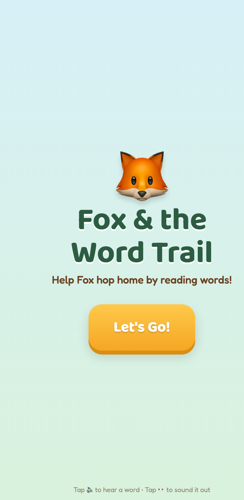

# Fox & the Word Trail 🦊📖

A little reading game I made for my son **Seth**. Help Fox hop home by reading words along the trail!

  

## ▶️ Play it

**https://codyvanscyoc.github.io/SethsReading/**

Works on any phone, tablet, or computer — no app to install. Best on a phone or tablet where Seth can tap.

## How to play

Pick a trail and help Fox get home by reading the words. Along the way:

- 🔊 **Tap the speaker** to hear a word read out loud
- 👀 **Tap the eyes** to sound it out, letter by letter
- 🖼️ **Picture hints** can be turned on or off as reading gets stronger

## Trails (they get harder as you go)

- **Word Trail** — start with *Little Words*, work up to *Big Kid Words*
- **Blend Trail** — practice blending letter sounds together
- **Letter Hunt** — find and shoot the right starting letter
- **Sentence Trail** — read two words, then whole sentences (no pictures)
- **Space Blast** — an arcade mode: blast the right word out of the sky 🚀

Get it right and Fox makes it home — 🏡 *"You did it!"*

## Run it on this computer

Just open `index.html` in any web browser. That's the whole game — one file, nothing to install.

---

Made with ❤️ for Seth.
